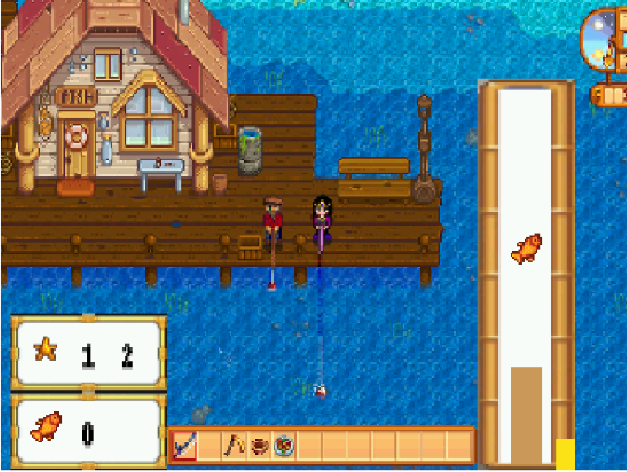
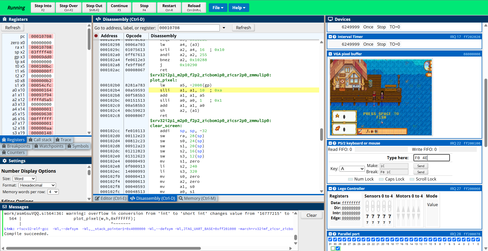
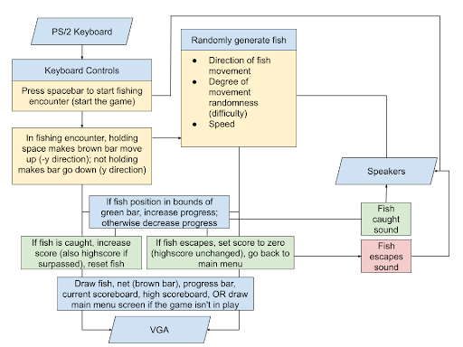

# IT IS AN ACADEMIC OFFENSE TO COPY CODE. THIS IS SIMPLY FOR REFERENCE
---
## Demo
[Click here to view demo](https://www.youtube.com/shorts/fMO8LDjOa7M)

---
## Work snapshot
while developping the game, we used CPUlator to simulate how the game would operate on the FPGA board. See image below for details

---
## Block diagram
the following block diagram represents the game flow we designed

---

